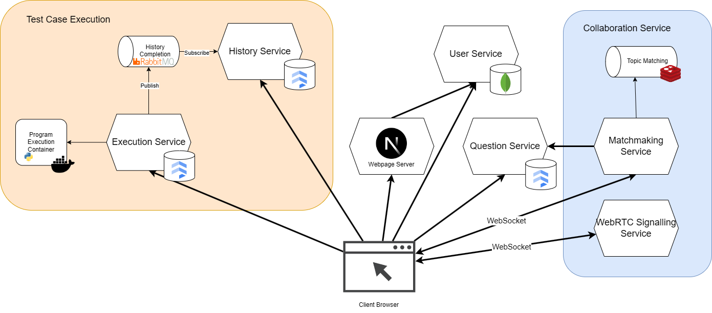
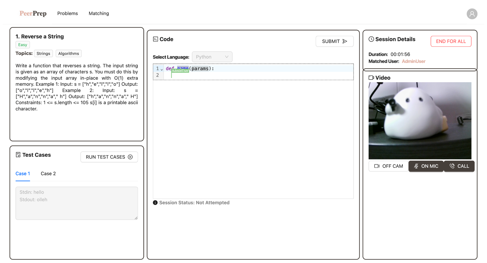
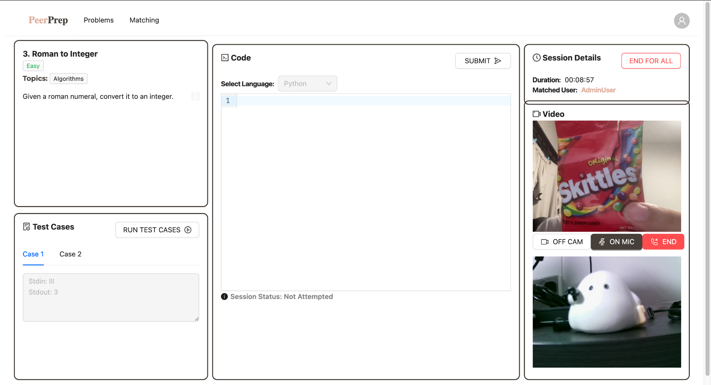
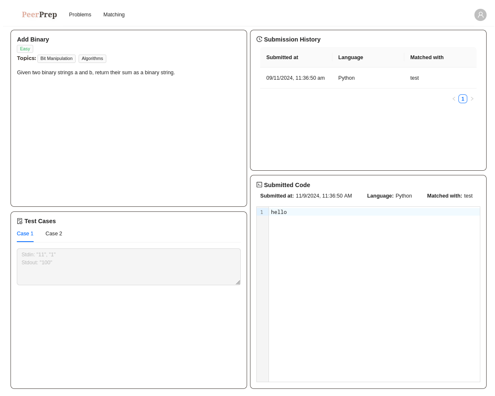
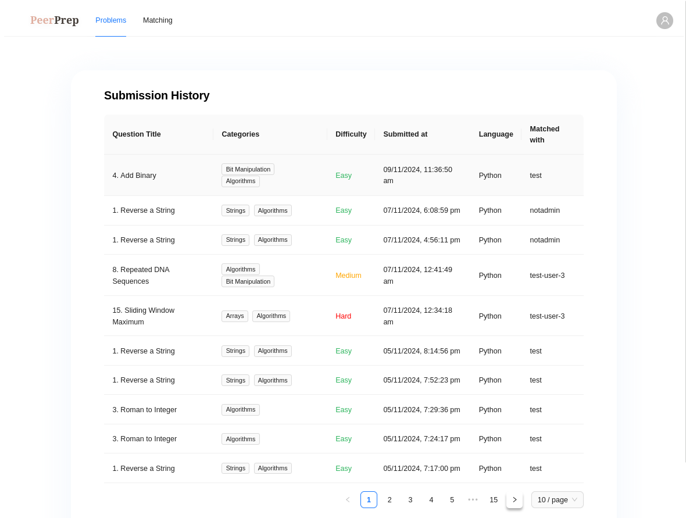

# CS3219 Project (PeerPrep) - AY2425S1

## Group: G24

### Note:

- You can choose to develop individual microservices within separate folders within this repository **OR** use individual repositories (all public) for each microservice.
- In the latter scenario, you should enable sub-modules on this GitHub classroom repository to manage the development/deployment **AND** add your mentor to the individual repositories as a collaborator.
- The teaching team should be given access to the repositories as we may require viewing the history of the repository in case of any disputes or disagreements.

---

## Architecture Diagram

The overall architecture of PeerPrep follows a microservices architecture. The client acts as an orchestrator for the interaction between the different services.

## Screenshots

## More details

- [Frontend](./apps/frontend/README.md)
- [User Service](./apps/user-service/README.md)
- [Question Service](./apps/question-service/README.md)
- [Matching Service](./apps/matching-service/README.md)
- [Signalling Service](./apps/signalling-service/README.md)
- [History Service](./apps/history-service/README.md)
- [Execution Service](./apps/execution-service/README.md)
- [CI/CD Guide](./docs/cicid.md)
- [Docker Compose Guide](./apps/README.md)
- [Set Up Guide](./docs/setup.md)
