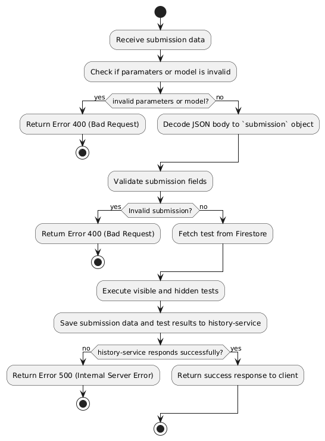

# Execution Service

The Execution Service provides backend functionality for running and validating code executions or submissions within a coding platform. It enables users to execute code against test cases and receive feedback on the correctness of their solutions.

The Execution Service incorporates a code execution mechanism designed to run user-submitted solutions within an isolated, sandboxed environment. This approach enhances security by preventing arbitrary code from interacting with the host system directly and allows for performance monitoring

### Technology Stack

- Golang (Go): Statically typed, compiled language with low latency. Fast and efficient processing is ideal for high-read, high-write environments like in Execution Service, when many users run tests or submit tests.
- Rest Server: chi router was utilized which supports CORS, logging and timeout via middlewares. It is stateless, which reduces coupling and enhances scalability and reliability, simplicity and flexibility. For example, clients may make requests to different server instances when scaled.
- Firebase Firestore: NoSQL Document database that is designed for automatic horizontal scaling and schema-less design that allows for flexibility as number of tests increases or more users run tests.
- Docker: used to containerize the Execution Service to simplify deployment. Additionally used to provide a sandboxed execution environment for user-submitted code, ensuring security by limiting code access to the host system and managing dependencies independently.

### Execution Process

For execution of user code (running of test cases without submission), only visible (public) and custom test cases are executed.


### Submission Process

For submission of user code, both visible (public) and hidden testcases are executed, before calling the history-service API to submit the submission data, code and test results.



### Design Decisions

1. **Docker Containerisation**
   a. Upon receiving a code execution request, the service dynamically creates a Docker container with a controlled environment tailored to Python
   b. The Docker container is set up with only the minimal permissions and resources needed to execute the code, restricting the execution environment to reduce risk
   c. This containerized environment is automatically destroyed after execution, ensuring no residual data or state remains between executions

2. **Security and Isolation**
   a. Containers provide isolation from the host system, limiting any interaction between user code and the underlying infrastructure
   b. Only essential files and libraries required for code execution are included, reducing potential attack surfaces within each container. The sandboxed, container-based execution system provides a secure and efficient way to run user code submissions.

The sandboxed, container-based execution system provides a secure and efficient way to run user code submissions.

### Communication between Execution and History Service

The communication between the Execution service and the History service is implemented through a RabbitMQ Message Queue. RabbitMQ is ideal for message queues in microservices due to its reliability, flexible routing, and scalability. It ensures messages aren’t lost through durable queues and supports complex routing to handle diverse messaging needs.

Asynchronous communication was chosen as a user’s submission history did not need to be updated immediately. Instead of waiting for a response, the Execution Service can put the message in a queue and continue processing other requests.


A message queue allows services to communicate without depending on each other's availability. The Execution Service can send a message to the queue, and the History Service can process it when it’s ready. This decoupling promotes loose coupling and reduces dependencies between services, which helps maintain a robust and adaptable system.

---

## Setup

### Prerequisites

Ensure you have Go installed on your machine.

### Installation

1. Install dependencies:

```bash
go mod tidy
```

2. Create the `.env` file from copying the `.env.example`, and copy the firebase JSON file into execution-service/ fill in the `FIREBASE_CREDENTIAL_PATH` with the path of the firebase credential JSON file.

### Running the Application

To start the server, run the following command:

```bash
go run main.go
```

The server will be available at http://localhost:8083.

### Setting up message queue with RabbitMQ

A message queue is used to pass submission results asynchronously from the execution-service to the history-service.

1. In order to do so, we can run the following command to set up a docker container for RabbitMQ:

```bash
docker run -d --name rabbitmq -p 5672:5672 -p 15672:15672 rabbitmq:3-management
```

2. Then we can run the execution-service:

```bash
go run main.go
```

3. We can run the history-service by changing our directory and running the same command:

```bash
cd ../history-service
go run main.go
```

To view more details on the RabbitMQ queue, we can go to `localhost:15672`, and login using `guest` as the username and password.

### Running the Application via Docker

To run the application via Docker, run the following command:

```bash
docker build -t execution-service .
```

```bash
docker run -p 8083:8083 --env-file .env -d execution-service
```

The server will be available at http://localhost:8083.

## API Endpoints

- `POST: /tests/populate`: Deletes and repopulates all tests in Firebase
- `GET: /{questionDocRefId}`: Reads the public testcases for the question, identified by the question reference ID
- `POST: /{questionDocRefId}/execute`: Executes the public testcases for the question, identified by the question reference ID
- `POST: /{questionDocRefId}/submit`: Executes the public and hidden testcases for the question, identified by the question reference ID, and submits the code submission to History Service

## Managing Firebase

To reset and repopulate the database, run the following command:

```bash
go run main.go
```

## Repopulate test cases

To repopulate test cases, you need to repopulate the questions in the question-service, which will automatically call the execution-service to populate the test cases.

In question-service, run the following command:

```bash
go run main.go -populate
```

## API Documentation

`GET /tests/{questionDocRefId}/`

To read visible test cases via a question ID, run the following command:

```bash
curl -X GET http://localhost:8083/tests/{questioinDocRefId}/ \
-H "Content-Type: application/json"
```

The following json format will be returned:

```json
[
  {
    "input": "hello",
    "expected": "olleh"
  }
]
```

`POST /tests/{questionDocRefId}/execute`

To execute test cases via a question ID without custom test cases, run the following command, with custom code and language:

```bash
curl -X POST http://localhost:8083/tests/{questioinDocRefId}/execute \
-H "Content-Type: application/json" \
-d '{
"code": "name = input()\nprint(name[::-1])",
"language": "Python"
}'
```

The following json format will be returned:

```json
{
  "visibleTestResults": [
    {
      "input": "hello",
      "expected": "olleh",
      "actual": "olleh",
      "passed": true,
      "error": ""
    }
  ],
  "customTestResults": null
}
```

To execute visible and custom test cases via a question ID with custom test cases, run the following command, with custom code, language and custom test cases:

```bash
curl -X POST http://localhost:8083/tests/{questioinDocRefId}/execute \
-H "Content-Type: application/json" \
-d '{
"code": "name = input()\nprint(name[::-1])",
"language": "Python",
"customTestCases": "2\nHannah\nhannaH\nabcdefg\ngfedcba\n"
}'
```

The following json format will be returned:

```json
{
  "visibleTestResults": [
    {
      "input": "hello",
      "expected": "olleh",
      "actual": "olleh",
      "passed": true,
      "error": ""
    }
  ],
  "customTestResults": [
    {
      "input": "Hannah",
      "expected": "hannaH",
      "actual": "hannaH",
      "passed": true,
      "error": ""
    },
    {
      "input": "abcdefg",
      "expected": "gfedcba",
      "actual": "gfedcba",
      "passed": true,
      "error": ""
    }
  ]
}
```

`POST /tests/{questionDocRefId}/submit`

To submit a solution and execute visible and hidden test cases via a question ID, run the following command, with custom code and language:

```bash
curl -X POST http://localhost:8083/tests/{questioinDocRefId}/submit \
-H "Content-Type: application/json" \
-d '{
"title": "Example Title",
"code": "name = input()\nprint(name[::-1])",
"language": "Python",
"user": "user123",
"matchedUser": "user456",
"matchedTopics": ["topic1", "topic2"],
"questionDifficulty": "Medium",
"questionTopics": ["Loops", "Strings"]
}'
```

The following json format will be returned:

```json
{
  "visibleTestResults": [
    {
      "input": "hello",
      "expected": "olleh",
      "actual": "olleh",
      "passed": true,
      "error": ""
    }
  ],
  "hiddenTestResults": {
    "passed": 2,
    "total": 2
  },
  "status": "Accepted"
}
```

If compilation error exists or any of the tests (visible and hidden) fails, status "Attempted" will be returned:

```json
{
  "visibleTestResults": [
    {
      "input": "hello",
      "expected": "olleh",
      "actual": "",
      "passed": false,
      "error": "Command execution failed: Traceback (most recent call last):\n  File \"/tmp/4149249165.py\", line 2, in \u003cmodule\u003e\n    prit(name[::-1])\n    ^^^^\nNameError: name 'prit' is not defined. Did you mean: 'print'?\n: %!w(*exec.ExitError=\u0026{0x4000364678 []})"
    }
  ],
  "hiddenTestResults": {
    "passed": 0,
    "total": 2
  },
  "status": "Attempted"
}
```
