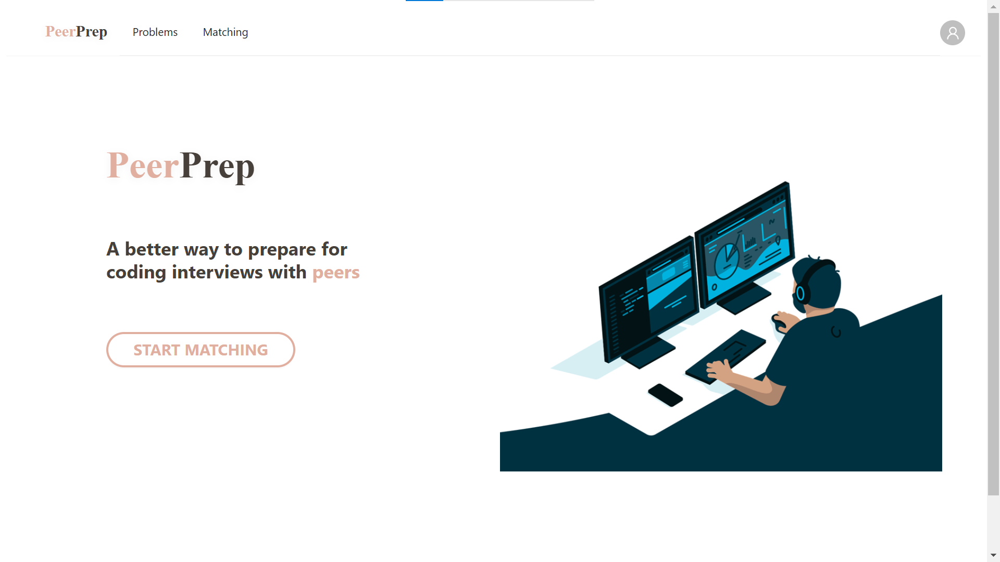
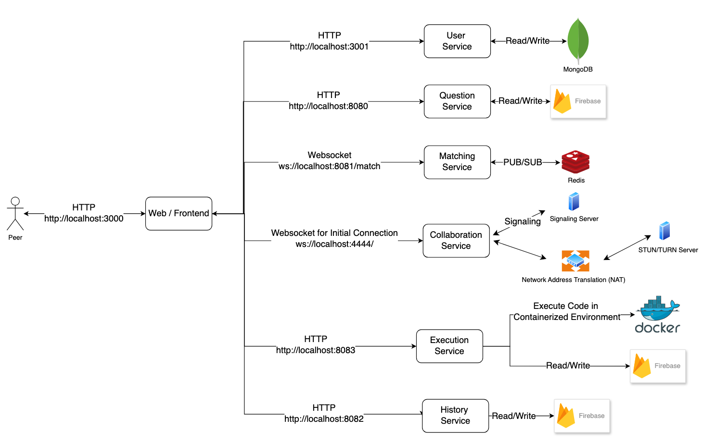

# Frontend



### Tech Stack

- React: React is one of the most popular UI libraries that allows the creation of reusable UI functional components. Its community ecosystem also offers React hooks that simplify the implementation of some of our frontend components, such as websockets.
- Next.js: A React framework for building single-page applications. It comes with several useful features such as automatic page routing based on filesystem.
- Ant Design: An enterprise-level design system that comes with several extensible UI components and solutions out-of-the-box, which allows us to quickly create nice-looking components that can be adjusted according to our requirements.
- Typescript: A language extension of Javascript that allows us to perform static type-checking, to ensure that issues with incorrectly used types are caught and resolved as early as possible, improving code maintainability.

### Authorization-based Route Protection with Next.js Middleware

Middleware is a Next.js feature that allows the webpage server to intercept page requests and perform checks before serving the webpage. We used this feature to protect page access from unauthenticated users. This was done by checking the request’s JWT token (passed as a cookie) against the user service and redirecting users without authorized access to a public route (namely, the login page).

### User Flow and Communication between Microservices

Clients interact with the microservices through dedicated endpoints, with each microservice managing its own database for independent reading and writing.

Having individual databases per microservice improves data security, scalability, fault isolation, flexibility in database choice, and development efficiency. This approach allows each microservice to operate independently, optimizing stability, performance, and adaptability in the system.



---

## Getting Started

First, install the dependencies:

```bash
npm install -g pnpm

pnpm install --frozen-lockfile

# if pnpm install --frozen-lockfile fails, try running
pnpm install
```

Then, follow the `.env.example` file and create a `.env` file in the current directory. Replace the necessary values within.

```bash
NEXT_PUBLIC_QUESTION_SERVICE_URL="http://localhost:8080"
NEXT_PUBLIC_USER_SERVICE_URL="http://localhost:3001/"
NEXT_PUBLIC_MATCHING_SERVICE_URL="ws://localhost:8081"
```

First, run the development server:

```bash
pnpm dev
```

Open [http://localhost:3000](http://localhost:3000) with your browser to see the result.

You can start editing the page by modifying `app/page.tsx`. The page auto-updates as you edit the file.

## Build Dockerfile

```sh
# Navigate to the frontend app directory
cd apps/frontend

# Build dockerfile (Ensure that your docker daemon is running beforehand)
docker build -t frontend -f Dockerfile .
```

Run the backend server locally and visit http://localhost:3000/ to see the frontend application working

## Running Docker Image

```sh
# Run the docker image, the -d tag is to run it detached
docker run -p 3000:3000 --env-file .env -d frontend

# To see the running container
docker ps

# To stop the container, copy the container id from the previous command
docker stop <container_id>
```
