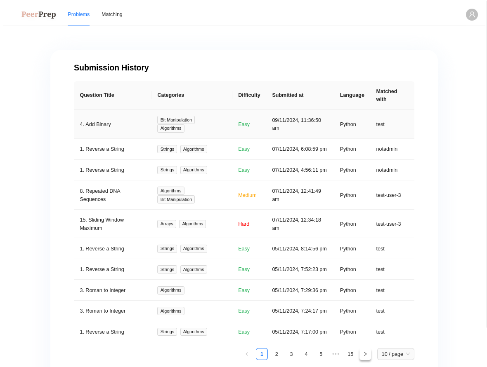

# History Service

The History Service is designed to store and retrieve a user’s code submission history. Users can view their past submission records of a collaboration session, with details such as the submitted date, the question attempted on, and the matched username. The information on the submission is stored within the history service’s database, and the data is accessed through querying the history-service from the frontend. It uses Google Firestore as a cloud-based NoSQL database for efficient and scalable data storage and retrieval. It is developed with a RESTful API structure, allowing flexibility for client applications to interact with the service.

### Technology Stack

- Golang (Go): Statically typed, compiled language with low latency. Fast and efficient processing is ideal for high-read, high-write environments like in history service.
- Firebase Firestore: NoSQL Document database that is designed for automatic horizontal scaling and schema-less design that allows for flexibility as application grows and new features are added.
- REST Server: chi router was utilized which supports CORS, logging and timeout via middlewares. It is stateless, which reduces coupling and enhances scalability and reliability, simplicity and flexibility. For example, clients may make requests to different server instances when scaled.
- Docker: used to containerize the History Service to simplify deployment.

### Design Decisions

The submission history is organized with the most recent submission displayed first, making it easy for users to review their past submissions. Pagination is implemented to help users find specific records efficiently and reduce the amount of data transferred when loading the page.



On the question page, users can view their past submissions for that question, allowing them to see their submitted code alongside the question details for better context.


Each submission record is created through the execution service via an asynchronous call, ensuring smooth and efficient processing (more details provided in the next section).

---

## Overview

The History Service is built with Go, utilizing Firestore as the database and Chi as the HTTP router. It allows for basic operations such as creating, reading, updating, and deleting question records.

## Features

- Create new collaboration history
- Read collaboration history by collaboration history ID
- Update collaboration history code
- Delete collaboration history

## Technologies Used

- Go (Golang)
- Firestore (Google Cloud Firestore)
- Chi (HTTP router)

## Getting Started

### Prerequisites

- Go 1.16 or later
- Google Cloud SDK
- Firestore database setup in your Google Cloud project

### Installation

1. Clone the repository

2. Set up your Firestore client

3. Install dependencies:

```bash
go mod tidy
```

4. Create the `.env` file from copying the `.env.example`, copying the firebase json key file into history-service directory, and fill in the `FIREBASE_CREDENTIAL_PATH` with the path of the firebase credential JSON file.

### Running the Application

To start the server, run the following command:

```bash
go run main.go
```

### Setting up message queue with RabbitMQ

A message queue is used to pass submission results asynchronously from the execution-service to the history-service.

1. In order to do so, we can run the following command to set up a docker container for RabbitMQ:

```bash
docker run -d --name rabbitmq -p 5672:5672 -p 15672:15672 rabbitmq:3-management
```

2. Then we can run the history-service:

```bash
go run main.go
```

3. We can run the execution-service by changing our directory and running the same command:

```bash
cd ../execution-service
go run main.go
```

To view more details on the RabbitMQ queue, we can go to `localhost:15672`, and login using `guest` as the username and password.

The server will be available at http://localhost:8082.

### Running the Application via Docker

To run the application via Docker, run the following command:

```bash
docker build -t history-service .
```

```bash
docker run -p 8082:8082 -d history-service
```

The server will be available at http://localhost:8082.

## API Endpoints

- `POST: /histories`: Create a history record of the code submission
- `GET: /histories/{historyDocRefId}`: Reads the history record of the code submission, identified by the history reference ID
- `GET: /histories/user/{username}`: Returns a paginated list of history records by a user, identified by the username
- `GET: /histories/user/{username}/question/{questionDocRefId}`: Returns a paginated list of history records by a user, for a question, identified by the username and question reference ID

```bash
go run main.go
```
