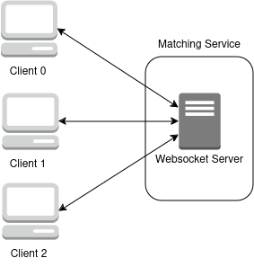
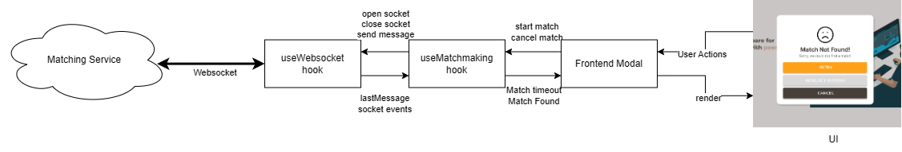
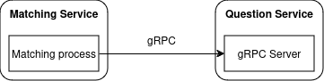
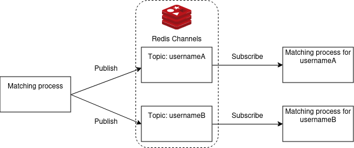

# Matching Service

The Matching Service is responsible for processing client match requests, efficiently pairing users based on specific criteria.

The Matching Service provides a WebSocket server to manage real-time matching requests through WebSocket connections. It is implemented in Go and uses the Gorilla WebSocket package to facilitate communication.

## Technology Stack

- Golang (Go): A high-performance, statically typed language, ideal for low-latency and fast data processing, ensuring quick response times in high-traffic matching scenarios.
- Redis: An in-memory data store used for fast data retrieval and management of match parameters. Redis supports key-value pairs and complex structures like lists and sets, providing rapid access for real-time matching.
- Websocket Server: Enables persistent, bidirectional communication between clients and the Matching Service, ensuring real-time updates and continuous connection without the need for frequent polling.
- gRPC Server: Chosen for its high-performance, efficient communication, and real-time capabilities, gRPC facilitates seamless communication within the system with the Question Service.
- Docker: Used to containerize the Matching Service, ensuring consistent deployment and simplified scaling across various environments.

## Design Decisions

### Websocket communication between clients and matching service

The Matching Service uses WebSockets for a persistent, real-time communication between the multiple clients and the backend, ensuring users remain connected during the matching process. Each client is assigned a unique connection that allows for real-time, two-way communication, eliminating the need for constant polling.



When a client sends a match request, the Websocket server receives the data. Once a match is found, the server pushes the final result directly to the client instantly, ensuring that the user receives real-time feedback without delay, optimizing the user experience.

Websocket’s persistent connection model helps to detect connection issues immediately. If a client disconnects, the server can identify the loss of connection through the closed WebSocket, triggering appropriate error handling.

### Frontend Matchmaking Interface

Several considerations were made when designing the component that receives the websocket connection and displays it in the UI.

- The Matchmaking API should be agnostic to the underlying websocket implementation.
- Each layer has its own intermediate state independently. (e.g. the matchmaking API stores whether it is searching for a match but not how long the matchmaking has taken.)
- The asynchronous nature of the websocket connection meant that the component must be designed to handle push events from the server.

A 3-layer architecture was implemented to meet these requirements.

1. A React Hook (an external library) is used to establish the websocket from the matching service.
2. A custom component (useMatchMaking) processes the raw messages and events sent by the websocket component and interprets them in the context of state matchmaking state. It then exposes this state to the user of the component.
3. The React UI component responsible for displaying the match state receives the state and redenrs it to the user.



When the user sends commands to the UI Component, such as to start a match or cancel matching, the Component determines whether to propagate the action to the next layer or not. For example, when the user closes the modal, this change does not propagate to the matchmaking component. However, if the user chooses to retry matchmaking, the UI Component must inform the matchmaking component to start another matchmaking session, which then informs the websocket component to open a connection to the matchmaking server.

### Matching Algorithm

The matching algorithm consists of two stages. The first stage finds two matching users. The second stage finds a matching question fitting the matched criteria. The first stage is implemented in the Matching service and the second stage is implemented in the Question service, in order to have separation of concerns of the different responsibilities.

The implications of having two stages means that it is possible for users to be matched on a question with a different topic or difficulty from what was specified by the user, if such a question does not exist in the database.

**Stage 1: Finding two matching users (in Matching Service)**

The matching algorithm prioritizes matching users that have been in the Redis queue the longest first, followed by users that have common topics/difficulties. If a user does not select any topics/difficulties, it is treated as the user does not need to match based on the topic/difficulty.

1. A new user joins the queue, starting the process of comparing the new user’s topics and difficulties against existing users in the queue. If the user is an existing user in the queue, an error is returned to the user.
2. If two different users have common topics or difficulties, the users are matched together, and a random match ID is generated.
3. The matched topics and difficulties are then used to query the question service to find a matching question in stage 2.

**Stage 2: Finding a matching question (in Question Service)**

When a matching question is found, the result is returned to the matching service tocomplete the matching process for the matched users.

1. If there are questions with any of the specified topics and any of the difficulties found, return one of those questions randomly.
2. If no questions from any of the specified topics and difficulty is found, find a question of any of the specified topics. If found, return one at random.
3. If no questions from any of the specified topics is found, find a question of any of the specified difficulties. If found, return one at random.
4. If no question is still found, then return a random question.

### Communication between Matching service and Question service

The communication between the Matching Service and the Question Service is implemented through gRPC API calls. Synchronous communication was chosen as the match result should be returned as soon as possible. gRPC was chosen as it has better performance compared to REST.



Each matching process in the Matching Service communicates via gRPC to the gRPC Server within the Question Service, when a match between two users is found (end of stage 1 in the matching algorithm). The information sent to the Question Service is used during stage 2 of the matching algorithm, and the result of stage 2 is sent as a response back to the matching process.

### Communication within Matching service

The Matching Service handles internal communication after the matching question is returned (end of stage 2 of the matching algorithm), utilizing Redis Pub/Sub messaging for inter-process communication.



The matching process that holds the match result only needs to know the topics (usernames) to publish to and the matching processes for each username can subscribe to only their topic, and retrieve the matching results from their respective topics (which is based on usernames).

This design decouples the process of determining the match and retrieving the question from the process of sending the match results back to the user, ensuring efficient and asynchronous communication between components.

---

## Setup

### Prerequisites

Ensure you have Go installed on your machine.

### Installation

1. Navigate to the matching service directory:

```bash
cd ./apps/matching-service
```

2. Install the necessary dependencies:

```bash
go mod tidy
```

3. Create a copy of the `.env.example` file as an `.env` file with the following environment variables:

- `PORT`: Specifies the port for the WebSocket server. Default is `8081`.
- `JWT_SECRET`: The secret key used to verify JWT tokens.
- `MATCH_TIMEOUT`: The time in seconds to wait for a match before timing out.
- `REDIS_URL`: The URL for the Redis server. Default is `localhost:6379`. If you are using docker, use `redis-container:6379`

4. Start a local Redis server:

```bash
docker run -d -p 6379:6379 redis
```

5. Start the WebSocket server:

```bash
go run main.go
```

## API Usage

To establish a WebSocket connection with the matching service, use the following JavaScript code:

```javascript
const ws = new WebSocket("ws://localhost:8081/match");
```

### Authentication

The initial WebSocket request should include a JWT token that contains the user’s ID as a claim. This token will be verified by the server to authenticate the user. The user ID extracted is used to identify the client and facilitate the matching process.

### Matching Workflow

1. **Sending Matching Parameter**s: Once the WebSocket connection is established, the client sends a message containing the matching parameters (e.g., preferred topics or difficulty levels).

2. **Receiving Match Results**:
   2.1. **Match Found**: If a match is found, the server sends the matching result back to the client via the WebSocket connection.
   2.2. **No Match Found**: If after a set amount of time, no match is found, the request timeouts, and the server sends a message that the matching failed.

3. **Connection Closure**:
   3.1. **Received Match Result**: After sending the match result, the server closes the connection.
   3.2. **Cancellation**: If the user cancels the matching process, the client should close the connection. The server will recognize this and cancel the ongoing match.

### Message Formats

Provide the structure of the messages being sent back and forth between the server and the client. This includes the format of the initial matching parameters and the response payload. All requests should be in JSON and contain the `type` field to handle different types of messages.

Client sends matching parameters:

```json
{
  "type": "match_request",
  "topics": ["Algorithms", "Arrays"],
  "difficulties": ["easy", "medium"],
  "username": "1f0myn"
}
```

Server response on successful match:

```json
{
  "type": "match_question_found",
  "match_id": "c377f463d380a9bd1dd03242892ef32e",
  "user": "1f0myn",
  "matched_user": "jrsznp",
  "matched_topics": ["Graphs", "Bit Manipulation", "Databases"],
  "question_doc_ref_id": "5lObMfyyKPgNXSuLcGEm",
  "question_name": "Repeated DNA Sequences",
  "question_difficulty": "medium",
  "question_topics": ["Algorithms", "Bit Manipulation"]
}
```

If no match is found after a set period of time, the server will send a timeout message:

```json
{
  "type": "timeout",
  "message": "No match found. Please try again later."
}
```

If user has an existing websocket connection and wants to initiate another match, the server will reject the request:

```json
{
  "type": "match_rejected",
  "message": "You are already in a matchmaking queue. Please disconnect before reconnecting."
}
```

If the server encounters an issue during the WebSocket connection or processing, the connection will be closed without any error message. The client should treat the unexpected closing as an error.

## Testing

Utilize `./tests/websocket-test.html` for a basic debugging interface of the matching service. This HTML file provides an interactive way to test the WebSocket connection, send matching requests, and observe responses from the server.

Make sure to open the HTML file in a web browser while the WebSocket server is running to perform your tests.

You can open one instance of the HTML file in multiple tabs to simulate multiple clients connecting to the server. (In the future: ensure that only one connection is allowed per user)

## Running the Application via Docker

Before running the following commands, ensure that the URL for the Redis server in `.env` file has been changed to `REDIS_URL=redis-container:6379`

To run the application via Docker, run the following command:

1. Set up the Go Docker container for the matching service

```bash
docker build -f Dockerfile -t match-go-app .
```

2. Create the Docker network for Redis and Go

```bash
docker network create redis-go-network
```

3. Start a new Redis container in detached mode using the Redis image from Docker Hub

```bash
docker run -d --name redis-container --network redis-go-network redis
```

4. Run the Go Docker container for the matching-service

```bash
docker run -d -p 8081:8081 --name go-app-container --network redis-go-network match-go-app
```

**NOTE:** As there is a dependency on the question-service to return the found questions, the matching-service does not work fully unless the question-service is present.
