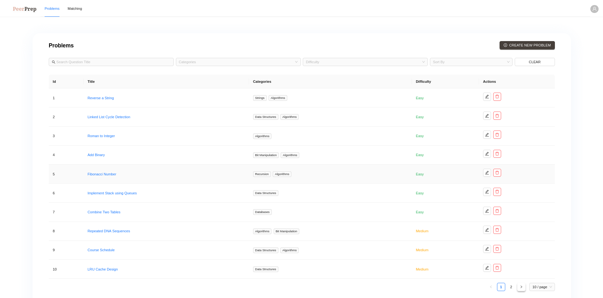

# Question Service

The Question Service is a core component of the system, dedicated to managing all interactions with question-related data. It handles the creation, retrieval, updating, and deletion of questions in the database, ensuring that users can efficiently access and manage question content for the application.

### Technology Stack

- Golang (Go): A fast, compiled language ideal for handling high-throughput, low-latency operations, making it perfect for rapid question data processing.
- Firebase Firestore: A NoSQL, schema-less database that scales horizontally and efficiently handles evolving data structures and growing amounts of question data.
- REST Server (chi router): A lightweight, stateless router for handling HTTP requests, offering flexibility, scalability, and built-in middleware support for CORS, logging, and timeouts.
- gRPC Server: Enables high-performance, real-time communication between microservices for efficient, reliable data exchange in the system with the Matching Service.
- Docker: Containerised the Question Service for consistent deployment across environments, simplifying testing, scaling, and management.

### Detailed Design and Implementation

The Question Service exposes several RESTful endpoints that allow clients to interact with question data. Each endpoint is designed to support the specific functionality needed for managing question information.

**Listing of Questions**

The `GET /questions` endpoint supports advanced pagination, search, filtering, and sorting features to enhance the user experience when querying for questions. By supporting multiple filtering and sorting criteria, the API adapts to a variety of user needs and use cases.

The endpoint supports efficient pagination, allowing clients to retrieve questions in smaller, manageable chunks. This prevents performance bottlenecks when dealing with large datasets. Clients can specify the limit (number of questions per page) to navigate through the data easily.

Users can search for questions based on specific keywords in the question name, providing relevant results quickly.

The endpoint supports robust filtering options that allow users to narrow down results based on several attributes like category and difficulty.

The endpoint also supports sorting of various fields like difficulty or date created.

These features combine to create a more dynamic, user-friendly interface for discovering questions, especially in large datasets, improving search efficiency and allowing users to quickly find the questions that match their needs. As the database grows, these features ensure that performance remains consistent, even with large volumes of data.



---

## Overview

The Question Service is built with Go, utilizing Firestore as the database and Chi as the HTTP router. It allows for basic operations such as creating, reading, updating, and deleting question records.

## Features

- Create new questions
- Retrieve question information by ID
- Update question details
- Delete question

## Technologies Used

- Go (Golang)
- Firestore (Google Cloud Firestore)
- Chi (HTTP router)

## Getting Started

### Prerequisites

- Go 1.16 or later
- Google Cloud SDK
- Firestore database setup in your Google Cloud project

### Installation

1. Clone the repository

2. Set up your Firestore client

3. Install dependencies:

```bash
go mod tidy
```

4. Create the `.env` file from copying the `.env.example`, and fill in the `FIREBASE_CREDENTIAL_PATH` with the path of the firebase credential JSON file.

### Running the Application

To start the server, run the following command:

```bash
go run main.go
```

The server will be available at http://localhost:8080.

## Running the Application via Docker

To run the application via Docker, run the following command:

```bash
docker build -t question-service .
```

```bash
docker run -p 8080:8080 -p 50051:50051 --env-file .env -d question-service
```

The server will be available at http://localhost:8080.

## API Endpoints

REST Service Endpoints

- `POST /questions`: Creates a new question in the database. This endpoint accepts the necessary data to define a new question, including the title, difficulty, topic, and any related metadata.
- `GET /questions/{id}`: Retrieves the data for a specific question using its unique ID. This endpoint returns all relevant details, including the question text, answers, and other metadata associated with the question.
- `GET /questions`: Fetches a list of questions. This can be customized with query parameters such as difficulty, topic, or pagination, allowing clients to retrieve a set of questions based on specific criteria.
- `PUT /questions/{id}`: Updates the data of an existing question. This allows partial updates, meaning clients can modify specific attributes (like difficulty or topic) without affecting other parts of the question data.
- `DELETE /questions/{id}`: Deletes a question from the database based on its ID. This removes the question and all its related data from the system.

## Managing Firebase

To reset and repopulate the database, run the following command:

```bash
go run main.go -populate
```
