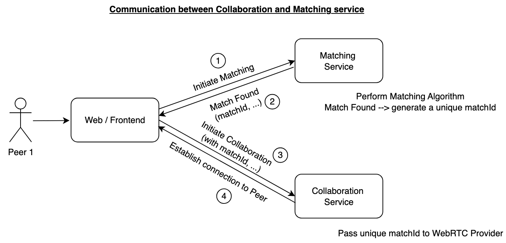
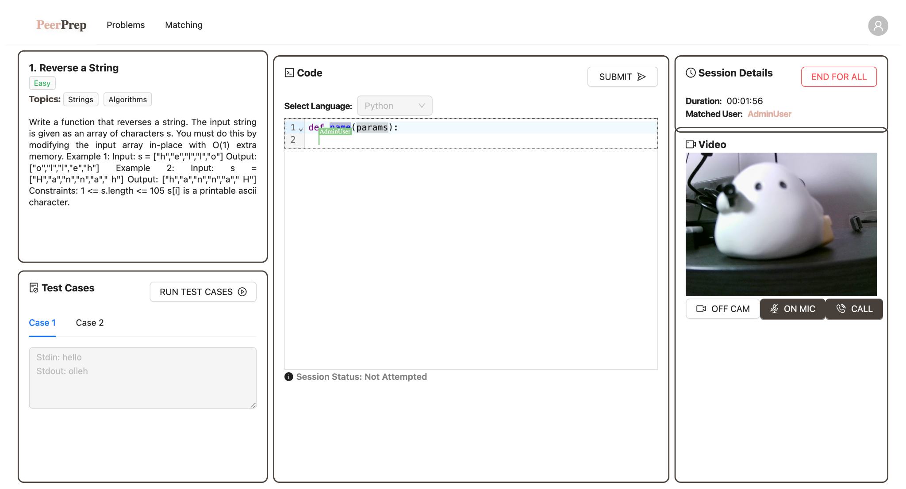
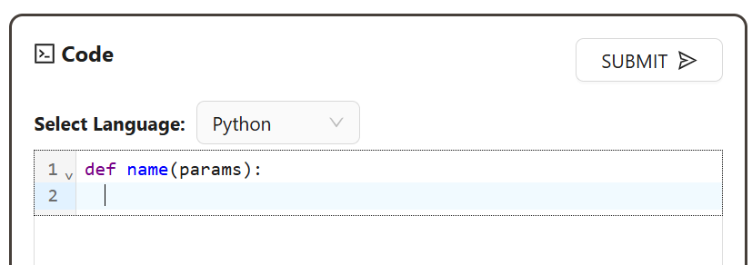

# Signalling Service

This is a signalling server that is used to establish WebRTC connections between users. It is built using Node.js and Socket.IO.

## Collaboration Service

The Collaboration Service is a microservice that is responsible for enabling real-time collaboration (e.g., code-editing) between two matched users and providing them with a live collaboration space (e.g., code editor).

Technology Stack

- Yjs: Yjs is a high-performance conflict-free replicated data type (CRDT) for building collaborative applications that sync automatically. It has multiple editor support, including CodeMirror and Monaco which are suitable for our use case to connect two peers to a collaboration space.
- WebRTC: WebRTC is a real time communication protocol that enables direct peer to peer connection. It allows us to connect the matched peers via a signaling server\* to establish the connection. Using y-webrtc which is a provider for Yjs, leveraging on WebRTC protocol, real time updates is enabled by allowing updates to a Yjs document that is shared between the users. (y-webrtc)
- CodeMirror: CodeMirror is an open source project that is a versatile text editor implemented in JavaScripts for the browser. It is good for code editing and comes in-built with multi language support with add-ons for syntax highlighting, CSS theming and also a rich programming api. This allows us to customize CodeMirror to the needs of PeerPrep, for e.g., auto-completion, syntax-highlighting and cursor hover for collaborative users. (y-codemirror)
- Signaling Server\*: Rather than using a public webrtc signaling server, we decided to host our own signaling server using the sample code provided by Yjs, this provides us with better control over scalability and less reliance over a third party service. This helps to ensure data privacy and customize the signaling server for events such as inactive timeouts.

### Communication between two users in a collaboration session

Each user will first initialize a websocket connection to the signaling server where the exchange of necessary information is done. This includes exchange of Interactive Connectivity Establishment (ICE) candidates which in turn uses a STUN/TURN server to allow peers to find a path for direct communication. The role of the signaling server is to act as the middleman to handle the initial connection and establishment of WebRTC connection between peers. After the connection is established, the signaling server is no longer involved in the communication between peers and the peers can directly communicate with one another via the data channel.

Utilizing the Yjs’s CDRT structure and CodeMirror, peers can synchronize updates to the coding space via the Yjs Document that is shared among them which enables them to perform live collaboration. The Yjs Document is uniquely identified through the `matchId` returned by the matching algorithm for both peers. The diagram below illustrates the establishment of the WebRTC data channel through the signaling server.


The key design decision here to use Peer-to-Peer (P2P) WebRTC connection rather than hosting a collaborative server is because each matched session only targets 2 users rather than a group of users. By creating a direct data channel connection between the matched users, we reduce the latency as compared to relaying through a collaborative server. Utilizing WebRTC connection abstracts away the need to host and manage our own collaborative server. This allows the application to scale without having the problem of bottleneck in the collaborative server due to increased server load from an increase in users. The decision also helps to reduce the complexity

### Communication between Matching Service and Collaboration Service

When two users are matched, a unique `matchId` will be generated within the Matching Microservice and returned to the Frontend Client. The Frontend Client will subsequently pass the `matchId` over to the collaboration service which will be used as the identifier for the room name in the Yjs’s WebRTC provider. This enables us to create a collaborative environment for the two matched users via the unique `matchId`. The matching service and the collaboration service communicate as shown in the diagram below.





## Communication

To enhance the collaboration between users in the collaboration space. We implemented a video and audio functionality which allows users to communicate visually and verbally.

### Technology Stack

- PeerJS: PeerJS is a wrapper around the browser’s WebRTC implementation to provide an easy P2P connection API, allowing transmission of data and/or media stream to remote peers.

### Design Decisions

We chose to implement the video and audio functionality over a chat functionality as it allows for immediate feedback while collaborating without a need to swap between the code environment and chat which can be a hassle. Furthermore, since the collaborative code editor can technically exist as a chat function, this offered more reason to opt for the video and audio functionality.

We chose PeerJS as it abstracts away the complexity of handling exchange of ICE candidates, network traversal and Network Address Translation (NAT) problems. It provides us with a simple wrapper and interface to work with so that we can focus on enhancing the UI components for the video display on the frontend with less worry on implementing the protocols on the backend.

The reason behind using the provided public PeerJS server rather than hosting our own is due to our small user base and the fact that we do not require custom server configurations. Without having to worry about maintaining the server’s infrastructure and the overhead involved, this allows us to focus on the application logic. This simplifies the development process, enabling us to focus our efforts into delivering the primary functionality. Since the existing public server is capable of handling low to medium applications, it can handle the existing needs of our application. However, if we foresee the load to increase, we will then swap to hosting one on our own to cater to the needs of PeerPrep.

### Communication between two users in the collaboration space

Similar to the collaborative service, PeerJS also utilizes a signaling server to help establish connection between two users. We establish the unique peer IDs as follows:

- Peer1’s ID: <peer1’s username>-<matchId> for e.g., `AdminUser-af6debdaae1daec04c9f33aa1eee0a6c`
- Peer2’s ID: <peer2’s username>-<matchId> for e.g, `test-af6debdaae1daec04c9f33aa1eee0a6c`

With the two unique IDs, an exchange of information is performed through the central signaling server provided by PeerJS. The signaling data comprises the unique peer’s ID, the ICE candidates and media capabilities. The process of establishing the connection between peers is similar to how one would try to contact a friend via their phone. Peer1 would initiate a call to Peer2 by specifying Peer2’s ID coupled with its own media stream. Peer2 on receiving the call, will accept and provide their own media stream.

Once the connection is established, the stream event will be fired and both users will be able to see one another’s media stream (both video and audio).


We also provided functionalities to allow users more media control options over the video/audio functionality. This enables them to on/off their video camera, on/off their microphone and initiate/end call sessions. The screenshot image below showcases an example of the video/audio functionality in PeerPrep.


## Enhancing Collaboration Service

The Collaboration Service is enhanced with a powerful code editor that facilitates real-time collaborative coding between users. By integrating CodeMirror, it provides an intuitive and interactive coding experience with features like syntax highlighting, code formatting, and automatic indentation.

This enhances user productivity and improves collaboration by making the code more readable and easier to work with. Users can seamlessly write, edit, and view code with minimal effort, improving the overall experience of real-time coding sessions.

### Technology Stack

- CodeMirror: A versatile code editor component for the web, providing features like syntax highlighting and code formatting. It supports a wide range of programming languages and offers a rich API for customization and extension.



CodeMirror allows for code formatting and syntax highlighting. With reference to the screenshot above, “def” and “name” are highlighted, and the 2nd line is auto-indented.

---

## Getting Started

First, install the dependencies:

```bash
npm install -g pnpm

pnpm install --frozen-lockfile

# if pnpm install --frozen-lockfile fails, try running
pnpm install
```

Then, follow the `.env.example` file and create a `.env` file in the current directory. Replace the necessary values within.

```bash
PORT=4444
```

First, run the development server:

```bash
pnpm dev
```

## Build Dockerfile

```bash
docker build -t signalling-service -f Dockerfile .
```

## Run Docker Container

```bash
docker run -p 4444:4444 --env-file .env -d signalling-service
```
