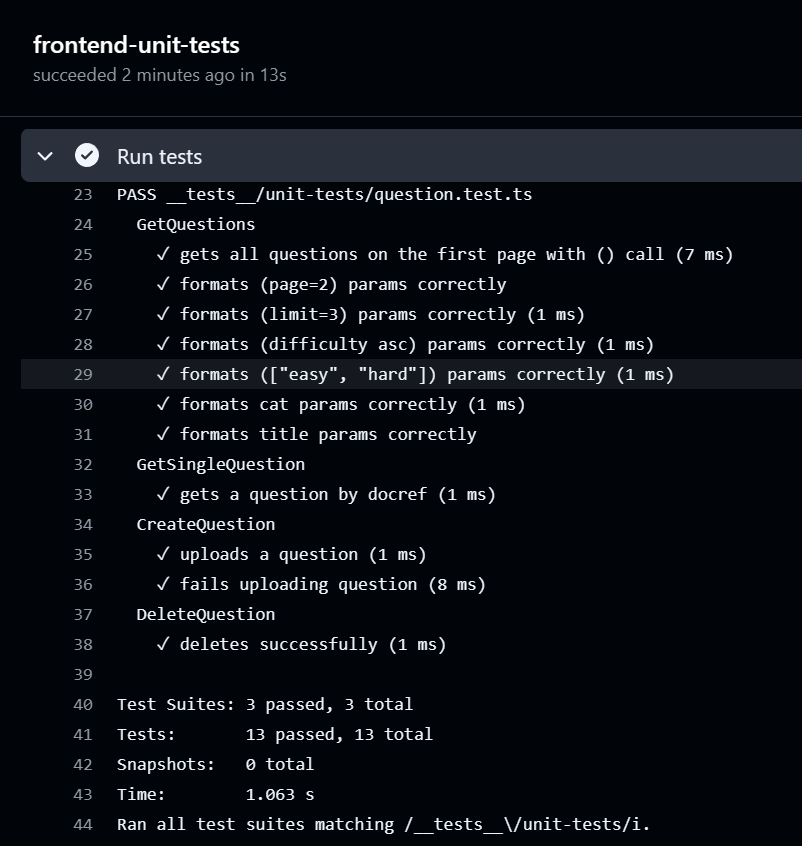
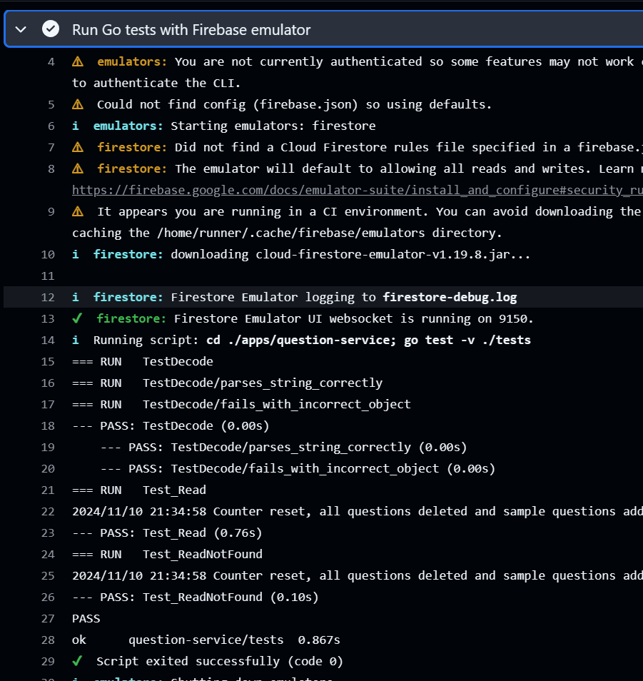
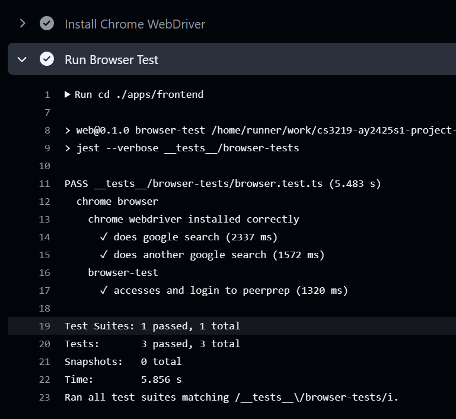

# CI/CD Guide

## CI with Github Actions

The variables and secrets were placed in Github Action’s environment secrets and environment variables, and referenced when running the workflows.

Whenever code is pushed to our main or staging branches, or a Pull Request is opened to these branches, the CI/CD pipeline is run. The pipeline workflow allows us to run the tests automatically on each commit.

## Frontend unit testing

Unit tests were done for the client-side functions for the question service API which fetch data from the question service.

We decided to use the Jest testing library for this purpose as the NextJs framework has builtin configurations for it, making integration into our work processes easier. Jest’s Mocking feature also allowed us to replace dependencies in code that would be called while running tests without modifying production code, even for functions in the global namespace such as the Fetch API. Injecting mock functions into test code allowed us to (a) simulate responses from the Question Service so that tests can be made deterministically and (b) verify that the functions under test are formatting queries correctly. Testing was done during CI by downloading the relevant dependencies in the runner and running the test.

## Question service Integration Testing

Integration testing was done for the Question service functions that access the Firestore database by starting a local Firestore emulator and modifying the client to point to it instead of the production database when making requests. Running a local emulator has the following advantages over testing against a remote database:

- When running tests, the emulator is loaded with a list of sample questions to create a controlled environment where the results of calls to the database are deterministic.
- Calls to a remote database have unpredictable latency and are susceptible to unexpected downtime which reduces testability Testing is done in CI by installing the emulator via firebase.tools and running the tests using the Go testing package.

## Browser Compatibility Testing

Browser compatibility testing was done for Google Chrome using Selenium, a popular browser automation tool.
For CI, Selenium and a publicly available webdriver for Chrome was downloaded. An automation script using the Jest library was used to emulate a basic case of a user accessing the page, entering login credentials and submitting the login form.

## Jobs in CI Workflow

1. question-service-test

   a. This job handles testing for the Question Service, which is dependent on Firebase and Go.
   b. It sets up the environment variables, firebase credentials, Go environment and dependencies and runs tests with firebase emulator.

2. frontend-unit-tests

   a. This job tests the frontend application using Node.js and pnpm
   b. It sets up the environment and Node.js and installs pnpm and dependencies, before running the frontend tests.

3. test-docker-compose

   a. This job uses Docker Compose to run multiple services together and validate inter-service connectivity.
   b. It sets up the environment files and database credential files across all services and builds and runs services with Docker Compose.
   c. The services’ availability are checked using curl and websocat to validate the HTTP endpoints and WebSocket endpoints respectively.
   d. Chrome compatibility test was done against the running frontend and user service endpoint.
